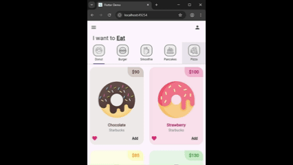

# 🍩 Donuts App

## 🧠 Brief Description

**Donuts App** is a Flutter-based mobile application that showcases a modern and interactive donut store interface. Users can explore different donut flavors, view detailed information, and add their favorite items to the cart.

---

## 🧩 Main Widgets Description

- **`HomePage`** 🏠 – Displays the main screen with donut categories and featured products.
- **`DonutTab`** 🍩 – Shows a tab with donut items filtered by type.
- **`DonutTile`** 🧱 – A reusable widget that displays each donut’s image, name, price, and “add to cart” button.
- **`CartPage`** 🛒 – Displays selected donuts, their quantities, and the total price.
- **`MyTab`** 🗂️ – A custom tab controller used to navigate between different donut categories.

---

## 💻 Technologies Used

- **Flutter** (Dart SDK)
- **Material Design**
- **Google Fonts**
- **Provider** for state management (optional)

---

## 🗂️ Project Structure

```
lib/
├── icons/                     # App icons and vector assets
├── images/                    # Donut and UI images
├── screens/
│   └── home_page.dart         # Main home screen with category navigation
├── tab/
│   ├── burger_tab.dart        # Tab for burger items
│   ├── burguer_tab.dart       # (Alternative or duplicate) burger tab
│   ├── donut_tab.dart         # Tab for donut items
│   ├── pancake_tab.dart       # Tab for pancake items
│   ├── pizza_tab.dart         # Tab for pizza items
│   └── smoothie_tab.dart      # Tab for smoothie items
├── utils/
│   ├── donut_tile.dart        # Widget displaying donut info
│   └── my_tab.dart            # Widget for tab design
├── video/
│   └──demo.gif                # GIF of project
└── main.dart                  # App entry point

```

---

## 🎥 Demo



---

## 📚 Course Information

**Subject:** Mobile Applications Development
**Teacher:** [RODRIGO FIDEL GAXIOLA SOSA]

---

## 🎨 Design Credits

Original design inspired by [App UI on Dribbble](https://dribbble.com/shots/19649140-App-UI) by [Dstudio](https://dribbble.com/Dstudio)

---

## ✨ Author

**Oscar Tadeo Pérez Bocos**
